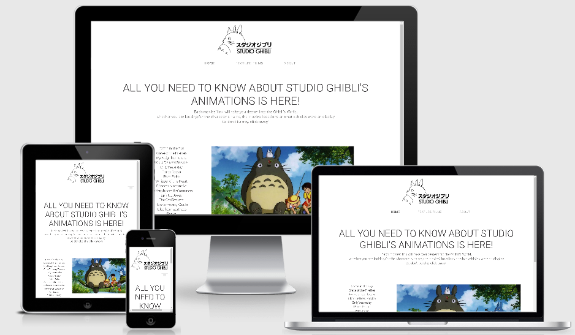
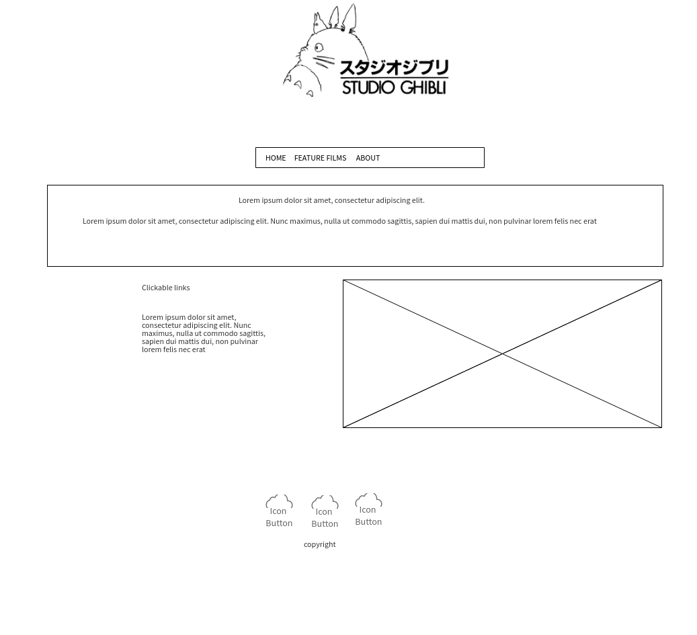
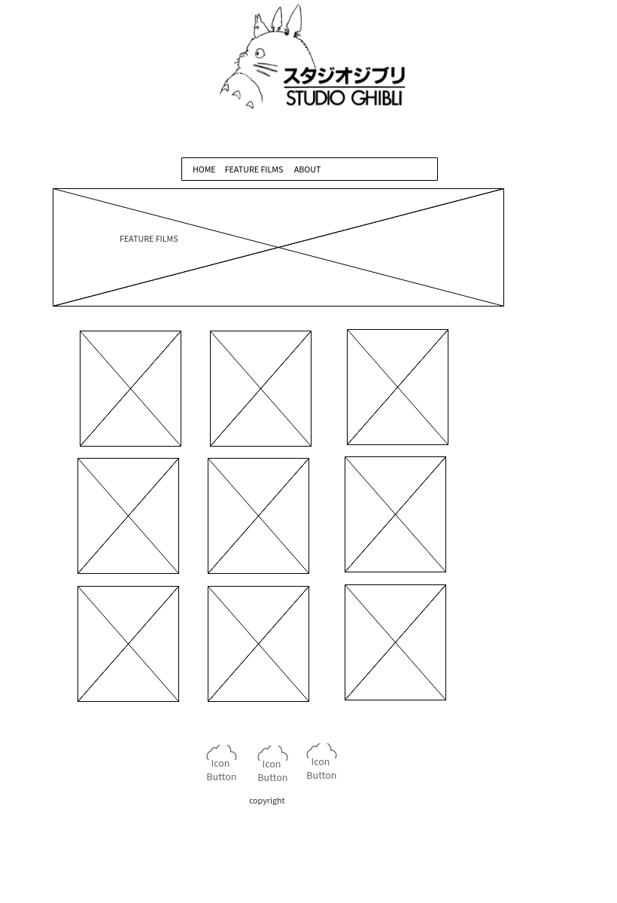
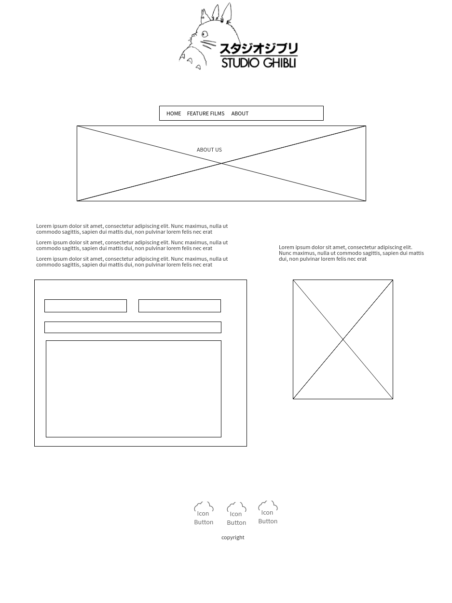

# STUDIO GHIBLI

This site will be an ongoing dynamic page, designed to give information on the Studio Ghibli’s movies.

It is a creation for the 2nd Milestone project as part of the Code institute Full stack software development diploma.

Its goal is to provide anyone who is passionate about Studio Ghibli a comprehensive set of data related to each movie. Whether it is related to its characters, locations, vehicles.

## UX

The purpose of the site is to allow the users to gain knowledge of the incredible characters, locations and vehicles each of the Studio Ghibli has developed.
It is also a place of information for those who are not familiar with Studio Ghibli, it provides simplified details of each movie laid out in cards with the movie jackets, descriptions, director, producer, release date and rt scores.

#### User Stories

- As a fan I would want to know more about each characters’, locations and vehicles details. Anything that is related to Studio Ghibli is a must know and I would happily subscribe to keep updated especially if there are new features to come.

- As a person whom is seeking general information on what are Studio Ghibli movies about, I would want to know what are the movies about, and if I want to ever watch them I will be looking for their RT scores, release date, description. This information will allow me to decide whether or not I want to be part of the Studio Ghibli’s experience.

## Wireframes

## Features

### Existing Features

- **Home** - provides an explanation of what to find on this page. The navigation bar is fixed on top so any user can feel free to navigate through the other pages and find out more about the site. This page is important as it provides the users with the option to click on any of the movies title as they are hyperlinked to the api so they can discover more about each movie. (details of every characters such as names, eye color, hair color, gender, age, locations name and type, vehicles: type and names)
- **feature films** - Allows the users to browse through the studio Ghibli’s movies and read about their description, and inform themselves about the release date, producer, director and rt scores.
- **about** - This gives a chance to anyone to stay in touch or request data or information related to the site or simply subscribe to stay tuned with the coming features by filling the contact form. It also gives an idea to the user as per where the site was originated on the world map.

### Features Left to Implement

- **feature films** - Embedding a youtube trailer for each movie
- **Streaming** - A page to allow the users to stream the movies they want to watch.

## Technologies Used

1.  **HTML, or Hyper Text Markup Language:**
2.  **CSS, or Cascading Style Sheets:**
3.  **Bootstrap:**
4.  **Javascript, AXIOS**
5.  **Gitpod:**
6.  **Git:**
7.  **GitHub:**
8.  **Chrome DevTools:**
9.  **W3C Markup Validation Service**

## Testing

1. http://ami.responsivedesign.is/ has been used to see how the site performs on different Apple devices and their viewports, all pages, links, icons performed as expected on all devices.
2. **Desktop** 
   - Google Chrome, Internet Edge & Mozilla Firefox browsers; all pages, links on those pages, and footer icon links perform well on all viewport sizes. Developer tools were also used on all browsers for the various viewport sizes.
3. **Mobile**
   - used both Huawei and Samsung S10 to check every pages and links, all performs well on all devices.
4.  **Contact Form**
    1.  Filling the contact us form: the form won’t allow to be sent unless all data is entered with a proper email address.
    2.  Upon clicking submit the form is submitting properly and the outcome is logged in the console (Success)
5.  **Issues encountered:** 
    - Part of my coding testing, JSHint was throwing back an error "template literal syntax' is only available in ES6 (use 'esversion: 6')", to get around it I have added /* jshint esversion: 6 */ at the top of my script.
    - It was really hard to find the right css styling for the card deck for the smaller screens as the cards shift so ended up finding the right devices min and max width to adapt.
    Another issue encountered was with the Google Maps API, first because in order to use the api, registering for billing is mandatory. Secondly once the map rendered on the bigger screen, it wouldn’t display on any mobile devices, the key here is to add all the referrers on the google map api site so to allow it to display on all the devices.

## Deployment

1. working with Github
2. After creating a repository all the files were uploaded on github through gitpod
3. The site is then published through the settings on github, at: https://jihanepett.github.io/_Studio_Ghibli/
4. Github gives the option to clone this workspace, for more information about the above process; https://help.github.com/en/github/creating-cloning-and-archiving-repositories/cloning-a-repository

## Credits

### Content

1. HTML & CSS Flip cards: https://www.w3schools.com/howto/howto_css_flip_card.asp
   Used on my feature films.
2. Google Fonts for font styles; https://fonts.google.com/

### Media

1.  Am I Responsive web site for checking responsiveness on all Apple devices screen sizes;
    http://ami.responsivedesign.is/
2.  https://stackoverflow.com/ w3schools Used as a resource for finding answers to all types of coding problems.
3.  JSHint to check my javascripts codes
4.  W3 validator to check html and css codes

### Acknowledgements

1. All of the Code institute members whom have provided great opinions, insights on my project and especially Kevin for the great tutoring session.
2. My super mentor Adeye Adegbenga for his time, great advices and all the support provided to achieve this project.
3. My family for giving me the precious time to study, work on the projects and keep it up
